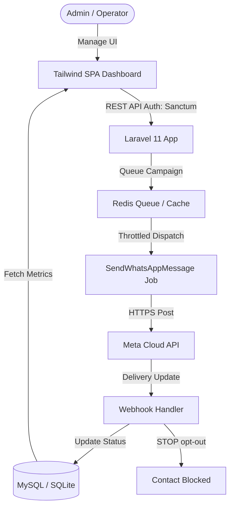

# 🚀 WhatsApp Business Pro (WHBusPro)

[](https://laravel.com)
[](https://php.net)
[](https://www.docker.com)
[](LICENSE)

An enterprise-grade, self-hosted bulk messaging and campaign management platform built on top of the official **Meta WhatsApp Cloud API (v20+)**. Features a real-time SPA dashboard, strict message rate-limiting (throttling), fault-tolerant circuit breakers, and flexible deployment models.

---

## 🗺️ System Architecture



---

## ✨ Key Features

*   **📊 Real-Time Analytics Dashboard:** Sleek glassmorphic dark-mode panel featuring delivery performance charts, live message logs, queue size indicators, and Meta phone number health status (GREEN/YELLOW/RED).
*   **🛠️ Dynamic Template Form Generator:** Fetches approved templates from the Meta Cloud API, calculates template body variables (`{{1}}`, `{{2}}`), and generates dynamic inputs automatically on campaign creation.
*   **⚡ Throttling & Rate-Limiting:** Atomic Redis/DB rate-limiters ensure message dispatches precisely align with Meta's quality tiers (e.g. max 60 messages/minute) to prevent spam flags.
*   **🔌 Fault-Tolerant Circuit Breaker:** Automatically pauses active campaigns if delivery errors or Meta API failures exceed a 10% threshold, preserving phone quality ratings.
*   **🔒 Secure API Access:** All endpoints are protected with light-weight token-based authentication (Laravel Sanctum).
*   **🛡️ Dynamic Settings Manager:** Edit and save Meta API keys, tokens, and endpoints directly from the Web Admin Panel without touching server environment `.env` files.
*   **🛑 Automated Opt-Out Handler:** Webhook automatically catches "STOP/DUR" keywords in replies and blocks contacts immediately to ensure legal compliance.

---

## 🛠️ Technology Stack

*   **Backend:** Laravel 11.x, PHP 8.2+, Sanctum
*   **Database:** MySQL 8.0 / SQLite (for local preview)
*   **Cache & Queue:** Redis / Predis
*   **Frontend:** Vanilla JS, Tailwind CSS CDN (Vite-free, zero compile step), Chart.js, Lucide Icons
*   **Infrastructure:** Docker Compose, Nginx, Supervisord queue worker

---

## 🚀 Installation & Deployment Guides

### Option A: VDS SSH Terminal (Recommended - Automated Script)

We provide a zero-configuration shell script to deploy, build, clean cache layers, and seed database credentials instantly on any Linux server:

1.  Clone the repository into your user directory:
    ```bash
    git clone https://github.com/265barancan/whbuspro.git ~/whbuspro
    cd ~/whbuspro
    ```
2.  Run the automated deployment script:
    ```bash
    bash deploy.sh
    ```
3.  Open `http://sunucu_ip_adresi:8080` in your browser.
4.  Log in using default admin credentials:
    *   **E-Mail:** `admin@whbuspro.com`
    *   **Password:** `admin12345`

### Option B: Portainer Stack Deployment (Docker)

To deploy the application inside your Portainer instance, read the detailed **[Portainer Deployment Guide](docs/portainer_deployment.md)**.

### Option C: cPanel Shared Hosting (Non-Docker PHP/MySQL)

To install on shared cPanel hosting via git-control and cron jobs, read the detailed **[cPanel Deployment Guide](docs/cpanel_deployment.md)**.

---

## 📈 Messaging Limits & Warm-up Strategy

Meta enforces message limits on new numbers. To safely upgrade your daily limits (1K -> 10K -> 100K) without getting banned, please follow the guidelines in our **[Warm-up and Limits Guide](docs/warmup_guide.md)**.

---

## 🧪 Testing & Quality Assurance

The codebase includes robust feature tests validating API authentication, webhook encryption signatures, circuit breakers, and rate-limiters.

To run the automated tests:
```bash
# Inside Docker VDS environment
docker compose exec -u www-data app php artisan test

# Inside local PHP environment
php artisan test
```

---

## 📄 License

This project is open-source software licensed under the [MIT License](LICENSE).
