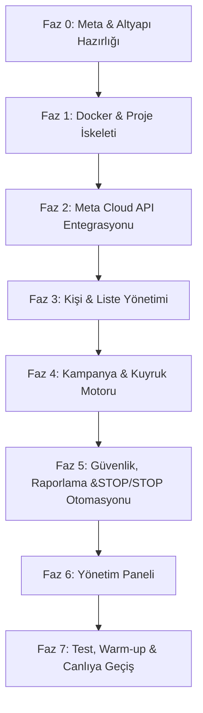

# WhatsApp Business Toplu Mesajlaşma Platformu — Geliştirme Yol Haritası (Roadmap)

Bu doküman, @[maniefst.md](file:///Users/barancan/Desktop/whbuspro/maniefst.md) dosyasındaki proje manifestosu doğrultusunda hazırlanmış detaylı geliştirme yol haritasıdır. Projenin başarıyla hayata geçirilmesi için mimari kararlar, fazlar, veritabanı optimizasyonları ve entegrasyon adımları burada yapılandırılmıştır.

---

## 1. Kritik Mimari Kararlar ve Öneriler

### 1.1. Framework Seçimi: Laravel vs. Slim 4
Projede **Laravel 11+** kullanımı önerilmektedir. Nedenleri:
*   **Hazır Kuyruk (Queue) ve Worker Desteği:** Toplu mesaj gönderimi arka planda asenkron yapılmalıdır. Laravel, Redis entegrasyonu ve `php artisan queue:work` (veya Laravel Horizon) ile gelişmiş hata yönetimi, otomatik yeniden deneme (retry) ve gecikme (delay) özelliklerini kutudan çıktığı gibi sunar.
*   **Database Migrations & Eloquent ORM:** PDO prepared statement yapısını zorunlu kılar, SQL injection riskini ortadan kaldırır ve şema değişikliklerini izlenebilir kılar.
*   **Scheduler (Zamanlayıcı):** Linux cron'a sadece tek bir giriş (`* * * * * php artisan schedule:run`) ekleyerek tüm periyodik işleri (örn. kampanya zamanlaması, kalite puanı kontrolü) kod seviyesinde yönetmeyi sağlar.
*   **Webhook Routing & Middleware:** Meta'dan gelen webhook isteklerinin imzalanmasını ve doğrulanmasını kolaylaştıran middleware yapısı hazırdır.

> [!NOTE]
> Slim 4 kullanılmak istenirse, Redis Queue için `php-enqueue` veya `resque` gibi harici kütüphaneler kurulmalı, CLI komutları için `symfony/console` entegre edilmeli ve bir migration kütüphanesi (örn. `phinx`) eklenmelidir. Bu da Laravel'in sağladığı altyapıyı manuel kurmak anlamına gelecektir.

### 1.2. Docker ve Webhook Geliştirme Ortamı
*   **Yerel SSL & Webhook Testi:** Meta Cloud API, webhook'ların yalnızca **HTTPS** üzerinden çalışmasını zorunlu kılar. Yerel geliştirme ortamında webhook isteklerini alabilmek için **ngrok** veya **localtunnel** gibi bir araç kullanılacaktır.
*   **Docker Hizmetleri:**
    *   `app` (PHP-FPM 8.2/8.3)
    *   `web` (Nginx)
    *   `db` (MySQL 8.x)
    *   `cache` (Redis 7.x)
    *   `worker` (PHP CLI - Supervisord ile sürekli çalışan kuyruk işçisi)
    *   `tunnel` (ngrok - opsiyonel, docker-compose içine gömülebilir)

---

## 2. Veritabanı Şeması İyileştirmeleri ve İndeksler

Manifestodaki SQL şeması oldukça sağlamdır. Ancak performans ve güvenilirlik için şu indeksler ve alanlar eklenmelidir:

```sql
-- contacts tablosuna indeks eklenmesi
CREATE INDEX idx_contacts_status ON contacts (status);

-- messages tablosuna Meta Message ID indeksi (Webhook durum güncellemelerini hızlı bulmak için)
CREATE UNIQUE INDEX idx_messages_wa_id ON messages (wa_message_id);

-- api_logs tablosuna endpoint ve http_status indeksleri
CREATE INDEX idx_api_logs_endpoint ON api_logs (endpoint);
CREATE INDEX idx_api_logs_status ON api_logs (http_status);
```

---

## 3. Adım Adım Geliştirme Fazları (Genişletilmiş Yol Haritası)



### Faz 0 — Hazırlık ve Kurulum (Süre: 3-5 Gün)
*   [ ] **Meta Geliştirici Hesabı:** [developers.facebook.com](https://developers.facebook.com) üzerinden bir uygulama oluşturulması.
*   [ ] **WhatsApp Business API Kurulumu:** Test numarası atanması, geçici token alınması.
*   [ ] **Kalıcı Token ve System User:** Meta Business Manager üzerinden kalıcı erişim anahtarı (`Permanent Access Token`) üretilmesi.
*   [ ] **İlk Şablon (Template) Tanımı:** Testler için Meta paneli üzerinden basit bir marketing/utility şablonu oluşturup onaya gönderilmesi.

### Faz 1 — Geliştirme Ortamı & Altyapı (Süre: 5-7 Gün)
*   [ ] **Docker Compose Hazırlığı:** Nginx, PHP, MySQL, Redis, worker servislerini içeren `docker-compose.yml` oluşturulması.
*   [ ] **Proje Başlangıcı:** Laravel (veya Slim) projesinin Docker içinde ayağa kaldırılması.
*   [ ] **Veritabanı Katmanı:** Migrations ve seeders dosyalarının yazılması, PDO/Eloquent bağlantılarının ayarlanması.
*   [ ] **Çevre Değişkenleri (`.env`):** DB bilgileri, Redis ayarları ve Meta API credentials (`WHATSAPP_TOKEN`, `WHATSAPP_PHONE_NUMBER_ID`, `WHATSAPP_APP_SECRET`, `WHATSAPP_VERIFY_TOKEN`) yapılandırılması.

### Faz 2 — Meta API Entegrasyonu & Webhook (Süre: 7-10 Gün)
*   [ ] **WhatsApp HTTP Client:** Meta Graph API v20+ uyumlu `WhatsAppClient` servis sınıfının yazılması.
    *   Şablonları senkronize etme (`GET /{{phone-number-id}}/message_templates`)
    *   Şablonlu mesaj gönderme (`POST /{{phone-number-id}}/messages`)
*   [ ] **Webhook Endpoint Altyapısı:**
    *   Doğrulama (Verification GET isteği)
    *   İmza Doğrulama (Signature POST isteği, `X-Hub-Signature-256` HMAC-SHA256 kontrolü)
*   [ ] **Webhook Event Handler:**
    *   Mesaj durum güncellemelerinin (`sent`, `delivered`, `read`, `failed`) yakalanıp `messages` tablosuna işlenmesi.
    *   Gelen (Inbound) kullanıcı mesajlarının yakalanması.
    *   `api_logs` tablosuna tüm webhook payload'larının ham şekilde kaydedilmesi.

### Faz 3 — Kişi, Liste ve Segmentasyon (Süre: 5-7 Gün)
*   [ ] **Telefon Numarası Validatörü:** E.164 format kontrolü yapan ve duplicate kayıtları önleyen servis.
*   [ ] **Kişi Yönetimi:** CRUD arayüzü ve API'leri.
*   [ ] **CSV/Excel Import:** Büyük listelerin sisteme yüklenmesi için kuyruk destekli dosya okuyucu.
*   [ ] **Opt-in Durumu Kontrolü:** KVKK/GDPR gereği `opted_in` bayrağının yönetimi.

### Faz 4 — Kampanya ve Kuyruk Sistemi (Süre: 10-14 Gün)
*   [ ] **Kuyruk Mimarisi (Redis):** Kuyruk kuyruk yapılarının tanımlanması (örn. `high`, `default`, `low`).
*   [ ] **Throttling (Hız Sınırlaması):** Kampanya bazlı `throttle_per_minute` (dakikada gönderilecek mesaj sayısı) değerini uygulayan algoritma (Token Bucket veya Redis rate limiter).
*   [ ] **Kampanya Worker:**
    *   Kuyruktan işi çeken PHP worker.
    *   Kişinin opt-in durumunu ve son 24 saatlik cooldown süresini doğrulayan kontrol mekanizması.
    *   Meta API çağrısını yapma, başarılı gönderimlerde `wa_message_id` kaydetme, başarısızlarda hata kaydı oluşturma.
*   [ ] **Retry Mekanizması:** Geçici ağ hataları veya Meta rate-limit aşımlarında (HTTP 429) exponential backoff ile yeniden deneme mantığı.

### Faz 5 — İzleme, Raporlama ve Güvenlik Önlemleri (Süre: 7 Gün)
*   [ ] **Opt-out (STOP) Otomasyonu (Geliştirildi):**
    *   İçerik webhook'tan geldiğinde `Dur/STOP/Iptal` kelimeleri yakalanır, `contacts` tablosunda `opted_in = 0`, `status = blocked` yapılır ve `opted_out_at` damgalanır.
*   [ ] **Hata Oranı Circuit Breaker (Otomatik Durdurma Algoritması):**
    *   `SendWhatsAppMessage` işi çalışırken, her başarısız gönderimde o kampanyaya ait toplam gönderilen (`sent`, `delivered`, `read`, `failed` statüsündeki) mesajlar ile `failed` statüsündeki mesajlar oranlanır.
    *   Minimum değerlendirme boyutu (örn: 20 mesaj gönderildikten sonra) aşıldığında, başarısızlık oranı %10 veya üzerine çıkarsa, kampanya statüsü otomatik olarak `paused` yapılır ve yeni kuyruk işlerinin çalışması durdurulur.
*   [ ] **Meta Kalite Puanı (Quality Rating) İzleme Entegrasyonu:**
    *   Meta Business API üzerinden periyodik olarak (`GET /{{phone-number-id}}?fields=quality_rating,status`) kalite durumu (`GREEN`, `YELLOW`, `RED`) ve telefon numarası durumu (`CONNECTED`, `FLAGGED`, `RESTRICTED`) sorgulanır.
    *   Kalite puanı `RED` seviyesine düşerse veya numara durumu `FLAGGED` / `RESTRICTED` olursa, tüm aktif kampanyalar otomatik olarak durdurulur (`paused`) ve sistem günlüğü (Log) veya e-posta yoluyla alarm tetiklenir.
*   [ ] **Detaylı Raporlama ve Hata Logları API:**
    *   Kampanyalardaki okuma ve teslimat oranlarını canlı olarak hesaplayan API endpoint'leri.
    *   Başarısız olan gönderimlerin Meta hata kodlarını (`api_logs` ve `messages.error_message` üzerinden) listeleyen detaylı hata inceleme API'si.


### Faz 6 — Panel ve Kullanıcı Arayüzü (Süre: 7 Gün)
*   [ ] **API Kimlik Doğrulama (Auth Sistemi - Sanctum):**
    *   API güvenliği için hafif ve güvenli **Laravel Sanctum** paketinin entegrasyonu.
    *   Admin ve Operatör rolleri (`roles` tablosu veya `contacts` / `users` tablosunda rol kolonu).
    *   Kullanıcı Giriş (`POST /api/auth/login`) ve Çıkış (`POST /api/auth/logout`) endpoint'lerinin yazılması.
*   [ ] **Şablon (Template) Senkronizasyon Otomasyonu:**
    *   `POST /api/templates/sync` endpoint'i üzerinden Meta'daki tüm şablonların çekilip yerel `templates` tablosuna (ad, kategori, dil ve değişken sayısı) kaydedilmesi.
*   [ ] **Dinamik Kampanya Oluşturma Arayüzü API'leri:**
    *   Seçilen şablonun değişken sayısına (`body_variables_count`) göre panel tarafında dinamik input alanları oluşturulmasını destekleyen meta veri dönen servis.
*   [ ] **Yönetim Paneli (Arayüz Entegrasyonu - Vanilla JS/Vue & Tailwind):**
    *   Ana Sayfa (Dashboard): Canlı gönderim durumları, kalite puanı göstergesi, Redis kuyruk doluluk oranları.
    *   Kişi & Liste Ekranı: Excel/CSV yükleme alanı, kişi ekleme formu.
    *   Kampanya Ekranı: Yeni kampanya oluşturma, zamanlama, şablon seçildiğinde dinamik olarak beliren değişken girdileri formu.


### Faz 7 — Testler ve Canlıya Geçiş (Süre: 7 Gün)
*   [ ] **Gelişmiş Mock API Testleri ve Hata Simülasyonu:**
    *   Meta API'sinin geçici hatalar (HTTP 500), hız aşımı kısıtlamaları (HTTP 429) ve kalıcı token yetkisizliği (HTTP 401) durumlarının taklit edilerek retry mekanizmasının (exponential backoff) test edilmesi.
*   [ ] **Hız Sınırlama (Throttling) Simülasyon Testleri:**
    *   Kuyrukta (Redis veya yerel `sync` / `database` kuyruklarında) kampanya bazlı dakikalık hız sınırının (`throttle_per_minute`) doğrulanması.
    *   Gönderim aralarındaki rastgele gecikmelerin (Jitter) ve throttling sınırlarının milisaniye düzeyinde doğru işletildiğinin loglar üzerinden analizi.
*   [ ] **Hesap Isınma (Warm-up) ve Limit Ölçekleme Kılavuzu:**
    *   Yeni WhatsApp Business numaralarının günlük 1.000 mesajlık ilk limitinin, kalite puanı düşmeden 10.000'e ve ardından 100.000'e güvenle yükseltilmesi için günlük gönderim hacimlerinin kademeli artırılma programının (Warm-up planı) dokümante edilmesi.
*   [ ] **Supervisord Production Konfigürasyonu:**
    *   Canlı sunucuda worker'ların kesintisiz çalışması, logların şişmesini önleyecek `logrotate` ayarları ve sunucu yeniden başladığında otomatik devreye girme script'leri.


---

## 4. Kritik Başarı Faktörleri (Spama Düşmeme & Ban Önleme)

1.  **STOP Kelimesi Tespiti:** Webhook üzerinden gelen mesaj gövdeleri Regex (`/^(dur|stop|iptal|unsubscribe)/i`) ile sürekli taranmalı ve eşleşirse kişi anında kara listeye alınmalıdır.
2.  **Mesaj Gönderim Gecikmesi (Jitter):** Kuyruk işçisi her mesaj gönderimi arasına sabit bir süre yerine rastgele milisaniyeler (örn. `usleep(rand(500000, 1500000))`) ekleyerek bot tespit algoritmalarını minimize etmelidir.
3.  **Çift Opt-in (Double Opt-in):** Web sitesi veya reklam üzerinden numarasını bırakan kullanıcılara ilk template mesaj gönderilirken açık rızalarının onaylandığına dair bilgi sunulmalıdır.
